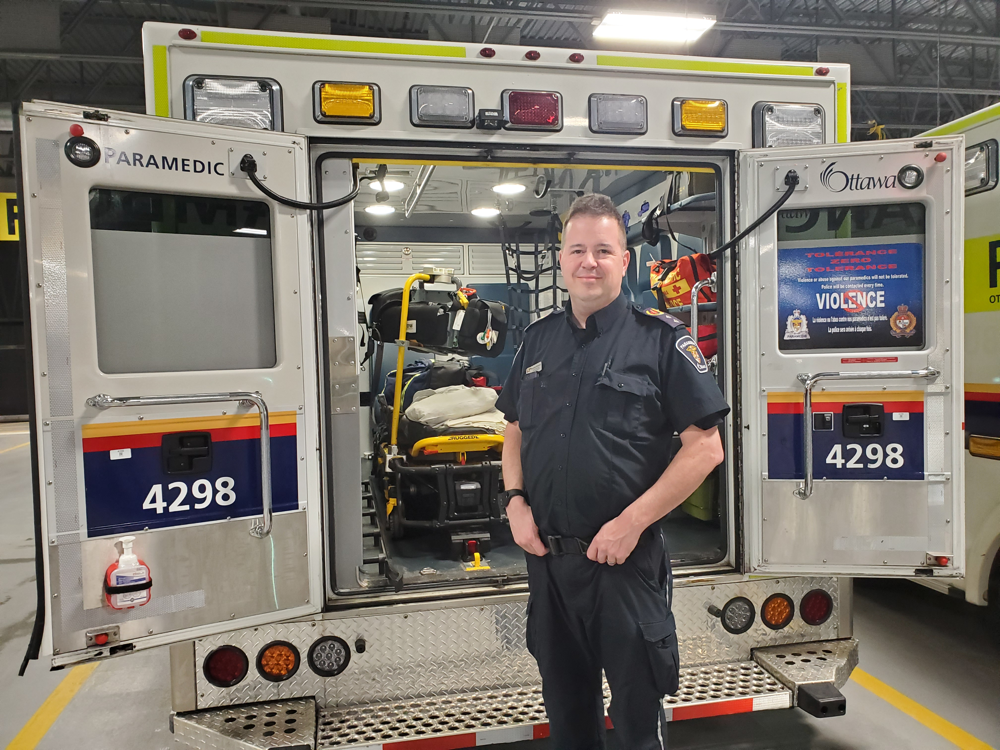
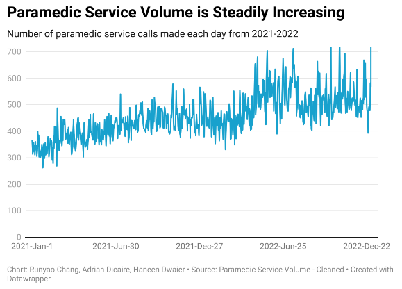
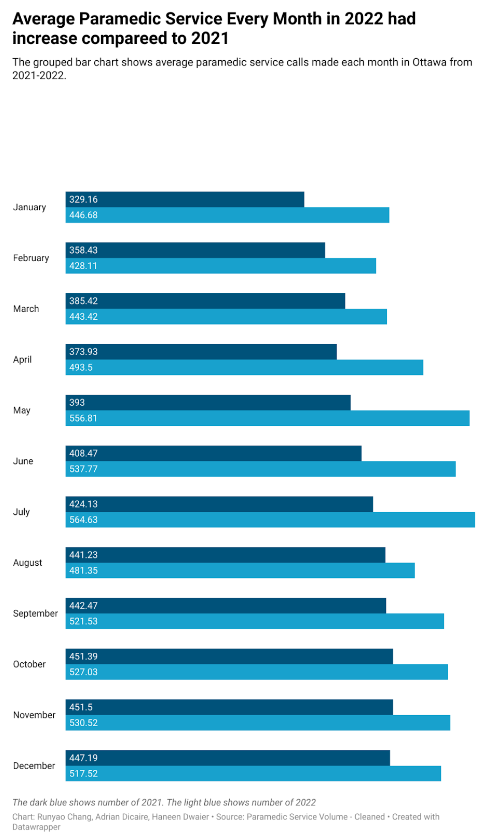

# Ottawa paramedics are feeling the strain of increasing calls for paramedic services

**By Adrian Dicaire, Haneen Dwaier, Runyao Chang** 
**December 22nd, 2023**

 
*Ottawa paramedics are facing a large increase in paramedic service requests each year*

An OpenOttawa dataset has revealed a pressing issue for Ottawa paramedics: paramedic service requests rose significantly from 2021-2022. In 2022, there were 184,000 requests made for ambulances, which is 23% higher than the previous year. This is expected to increase even further in 2023 and 2024.

However, this is not a new problem for paramedics. Marc-Antoine Deschamps, Superintendent of Public Information at Ottawa Paramedic Services, said that “over the last ten years, there has been a steady increase in the number of requests made for paramedics,” with the exception of the early stages of the pandemic in 2020 when people were afraid to go to the hospital and the number of requests decreased. 

 
*Marc-Antoine Deschamps, Superintendent of Public Information at Ottawa Paramedic Services*

This upward trend has unfortunately caused a lot of strain on Ottawa paramedics and has affected their ability to administer care to the communities they serve. Emily Fullarton, Vice-President of the Professional Paramedic Association of Ottawa, describes that paramedics can service “anywhere from 6 to 12 calls a day,” depending on how long it would take to check a patient into a hospital. 

 
*Emily Fullarton, Vice-President of Professional Paramedic Association of Ottawa*

Moreover, based on the OpenOttawa dataset, the average number of service requests per month has increased by approximately 95, meaning that about 3 more requests are made every day. This shows a very clear problem that Ottawa paramedics are facing and that things need to change in order to keep up with the growing demand for paramedic service requests. 

## The OpenOttawa dataset and our methodology

The original dataset OpenOttawa is called “Paramedic Response Volume.” It contained a table  showing Ottawa Paramedic Service request volume per day from 2021-2022. It showed the dates requests were made, an ID for the record, the corresponding year, and the total number of requests made on that day, including a few small counties on the edge of Ottawa. The dataset was created by the City of Ottawa from the Ottawa Paramedic Service’s annual report of paramedic service request volume. It was last updated September 2nd, 2023.

The original dataset can be found on [Open Ottawa](https://open.ottawa.ca/datasets/ottawa::paramedic-response-volume/explore?showTable=true).

To clean the dataset, we imported the dataset into Google Sheets. Then, we deleted the ID column as it was not needed. We added a “Month” column for it so we can calculate the quantity of the monthly total. Finally, the dates were out of order, so we put them back in order from January 1st, 2021 to December 31st, 2022. 

A cleaned version of the dataset can be found on this [Google Sheet](https://docs.google.com/spreadsheets/d/19XnjsFxXh5_FS6KKuQKs_lKl5RkfD3qzbWdRNqJkTCw/edit?usp=sharing).

We made three pivot tables to explore the data. For the first pivot table, we chose to compare the number of responses made each day over time. This was done to look for any obvious changes in service requests. For the second pivot table, we chose to compare the average number of service requests made each month in 2021 and 2022. This was done so we could see roughly how requests have increased over those two years, which we found to be 95 requests on average. For the third pivot table, we chose to compare the total number of requests made in 2021 and 2022 so we could calculate the percentage the requests increased by, which we found to be 23%.

We used Datawrapper to create a line chart to demonstrate the change in number of requests over time and a grouped bar chart to compare the average number of requests made each month between 2021-2022.

 
*Figure 1: Paramedic Service Volume from 2021-2022 (created with Datawrapper)*
[Interactive version here](https://datawrapper.dwcdn.net/ZV0KH/7/)

We chose a line chart because it would show an obvious increase in service requests between 2021 and 2022. Statistics Canada (2021) says in section 5.5 of their Power from Data site, the visual characteristics of the line chart clearly reveal data trends. It would also be useful for visualizing continuous data, which would be the dates.

 
*Figure 2: Average paramedic service requests made each month (created with Datawrapper)*
[Interactive version here](https://datawrapper.dwcdn.net/7Zkfh/6/)

We also created a bar chart to make a direct comparison of the average number of requests made each month from 2021-2022. Statistics Canada (2021) says in section 5.2 of their Power from Data site that the grouped column chart is good at directly comparing sets of data to one another. The dark blue bar represents the year 2021 and the light blue bar represents the year 2022.

## Why service requests are going up

The Ottawa Paramedic Service’s annual reports do not do a deep dive into the main causes of paramedic service request increases, nor the local demographics they impact. However, paramedics believe that there are a few contributing factors. 

According to Deschamps, one major factor is that the population is getting older, and older people require more medical assistance, resulting in many trips to the hospital via ambulance. Another major factor is that the population of the City of Ottawa is increasing each year, having passed 1 million people in 2019, resulting in more requests that can possibly be made. 

There are also many minor factors at play, including, but not limited to, people not having family doctors to consult and people using 911 for non-emergency situations.

## How these increases impact Ottawa paramedics

Increasing calls for paramedics result in more trips to hospitals. Fullarton described that paramedics often spend “an hour and a half to many hours at the hospital to offload a patient,” resulting in what are called “level-zero” events. These are times when no paramedics are available to answer service requests. The CBC reported that there were 1,819 “level-zero” incidents in 2022 and they continue to rise. 

These events “put a moral strain on paramedics on a day-to-day basis because they are often unavailable to serve the next person that needs them,” Fullarton said. This results in longer work shifts and paramedics not being able to spend much time at home.

 
*Paramedics often work around the clock to serve the increasing demand of service requests* 

## Paramedics are hopeful that solutions are coming

Paramedics believe that service requests will continue to increase no matter what and there are no solutions that can outright stop it. However, there are strategies and innovations they can make to mitigate it.

Both Deschamps and Fullarton agreed that the use of programs like Ontario Health Care Connect and SMART Transportation could reduce the number of requests made or the amount of time paramedics use on each request. Ontario Health Care Connect can be used to help people who do not have a family doctor find a medical provider so they can be called instead of 911. SMART Transportation can be used to quickly connect paramedics and patients to a physician to find alternate care and avoid unnecessary trips to the hospital.

Deschamps also said that investing in “sheer numbers” of new paramedics would not be the best solution. Alternatively, investing in these mitigation strategies would better meet the demand of service requests.

There is, however, one obstacle that is currently in the way of these mitigation strategies from truly succeeding: paramedics in Ontario are not considered healthcare professionals in the eyes of the law and do not have a regulatory body. Fullarton describes that “paramedics working with these models of care are working in a gray zone of the Ambulance Act,” which defines paramedics as someone who is “employed by a paramedic service and certified under a base hospital providing care through ambulances.” This definition limits the scope at which paramedics can treat patients, which contributes even more to the problem.

Paramedic services are currently petitioning the provincial government for changes in litigation to remove these limitations on paramedics, as well as funding for their mitigation strategies.

 
*Ottawa ambulances lined up in Ottawa Paramedic Service garage*

## Bibliography

Porter, K. (2023). *'Level zero' ambulance problem worsens dramatically in Ottawa in 2022*. CBC News. [https://www.cbc.ca/news/canada/ottawa/paramedic-level-zero-incidents-2022-availability-numbers-1.6746551](https://www.cbc.ca/news/canada/ottawa/paramedic-level-zero-incidents-2022-availability-numbers-1.6746551)

Statistics Canada (2021). *Statistics: Power from Data!*. [https://www150.statcan.gc.ca/n1/edu/power-pouvoir/ch9/bargraph-diagrammeabarres/5214818-eng.htm](https://www150.statcan.gc.ca/n1/edu/power-pouvoir/ch9/bargraph-diagrammeabarres/5214818-eng.htm)

